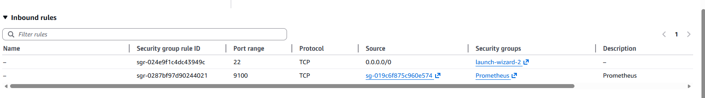
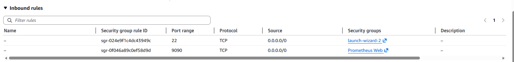
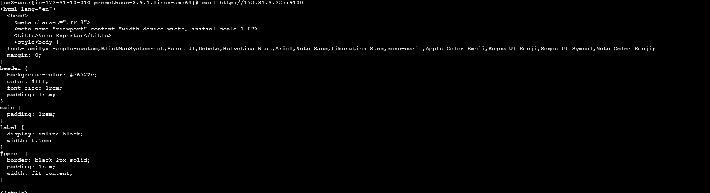
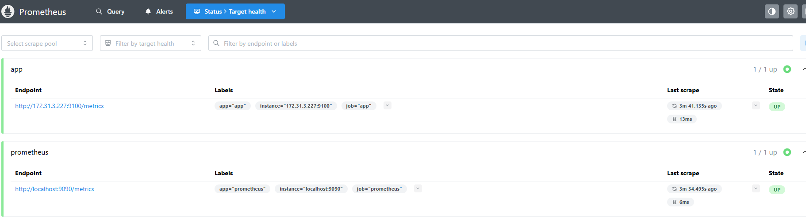
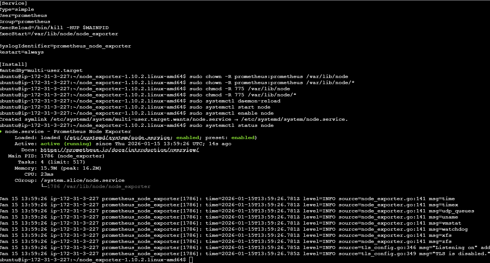

# Prometheus on AWS EC2

- Launch 2 Instances - App and Prometheus
- Node Exporter Security Groups

- Prometheus Security Groups



## Start App (Node Exporter)

```shell
wget https://github.com/prometheus/node_exporter/releases/download/v1.10.2/node_exporter-1.10.2.linux-amd64.tar.gz
tar -xvf node_exporter-1.10.2.linux-amd64.tar.gz
cd node_exporter-1.10.2.linux-amd64
./node_exporter
```

## Start Prometheus 

- Check connectivity with node

```shell
curl <NODE_PRIVATE_IP>:9100/metrics
```


- Download prometheus

```shell
wget https://github.com/prometheus/prometheus/releases/download/v3.9.1/prometheus-3.9.1.linux-amd64.tar.gz
cd prometheus-3.9.1.linux-amd64

```
- Edit prometheus.yml
- Add below at the end

```yaml
  - job_name: "app"

    # metrics_path defaults to '/metrics'
    # scheme defaults to 'http'.

    static_configs:
      - targets: ["172.31.3.227:9100"]
       # The label name is added as a label `label_name=<label_value>` to any timeseries scraped from this config.
        labels:
          app: "app"
```
- Start Prometheus
```shell
./prometheus
```

## App Discovered from Prometheus

- [Prometheus Public IP](http://3.135.214.111:9090/targets)
- 



## Make Node Exporter a Service
 
- Reference: https://github.com/aussiearef/Prometheus/blob/main/node.service

```ini
[Unit]
Description=Prometheus Node Exporter
Documentation=https://prometheus.io/docs/introduction/overview/
Wants=network-online.target
After=network-online.target

[Service]
Type=simple
User=prometheus
Group=prometheus
ExecReload=/bin/kill -HUP $MAINPID
ExecStart=/var/lib/node/node_exporter

SyslogIdentifier=prometheus_node_exporter
Restart=always

[Install]
WantedBy=multi-user.target
```


```shell
sudo groupadd --system prometheus
sudo useradd -s /sbin/nologin --system -g prometheus prometheus
sudo mkdir /var/lib/node
sudo mv node_exporter /var/lib/node

sudo vi /etc/systemd/system/node.service

# paste the contents
# save


sudo chown -R prometheus:prometheus /var/lib/node 
sudo chown -R prometheus:prometheus /var/lib/node/* 
sudo chmod -R 775 /var/lib/node
sudo chmod -R 775 /var/lib/node/*
sudo systemctl daemon-reload
sudo systemctl start node 
sudo systemctl enable node 
sudo systemctl status node 
```

