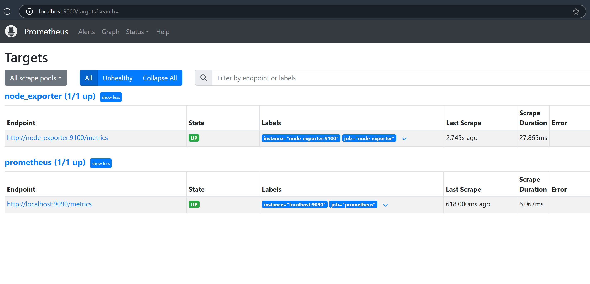
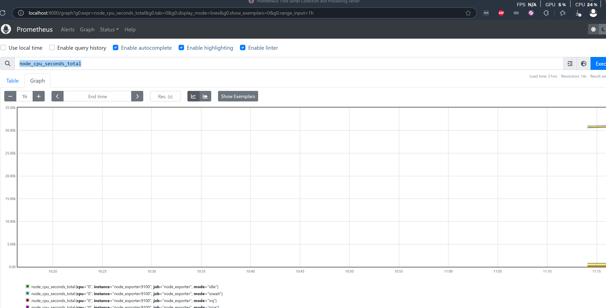

# Prometheus Quick Start

- [Getting Started](https://prometheus.io/docs/tutorials/getting_started/)

##  Example Output

- Targets

- Queries

# Types of metrics
- Counter -> always goes up, 
   - Number of requests, errors     
   - Rate() - history over a time frame
   - rate(some_count[5m]) 
- Gauge -> can go up or down
   - Number of running pods, events in a queue
   - max_over_time, min_over_time, avg_over_time

- Histogram 
  - Counted based on bucket values
  - Time takes to reply to request - latency
  - Buckets of <=0.3s, <=0.5s, <=0.7s, <=1.2s
  Metric: prometheus_http_request_duration_seconds_bucket{handler="/graph"}
  - histogram_quantile(0.9, metric)
	- 90th percentile 
	
- Summary metrics
  - Aggregation of metrics
  - Calculated at application level, lose more data