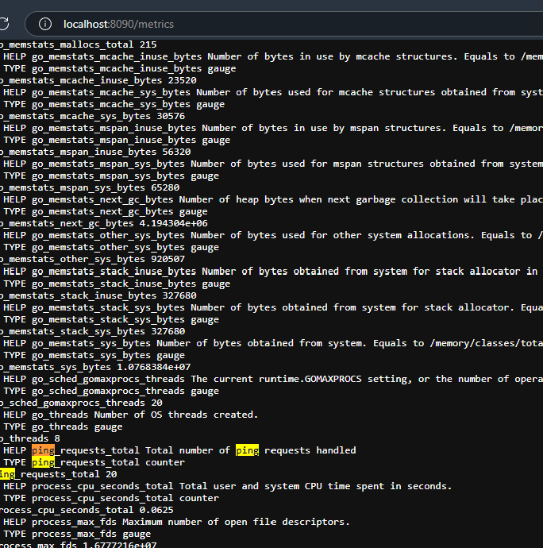
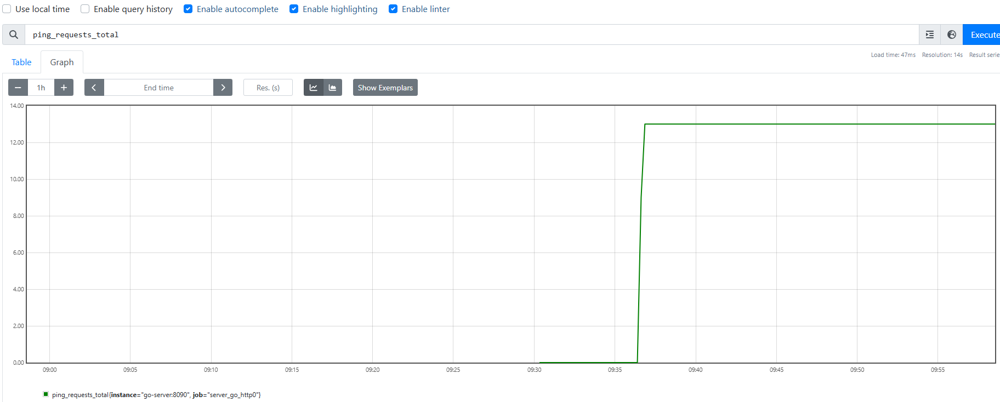
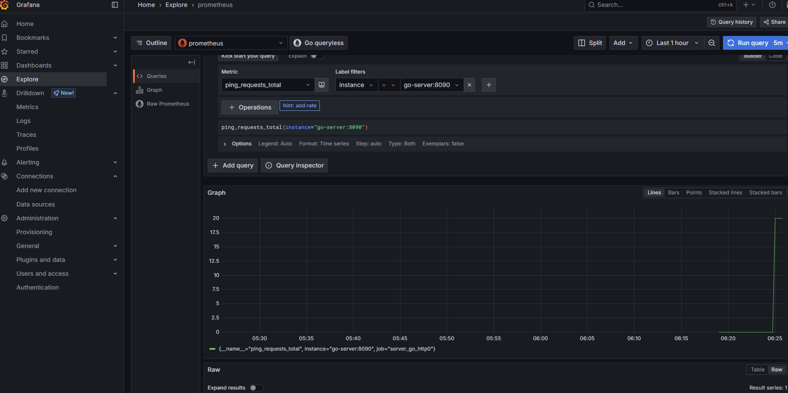
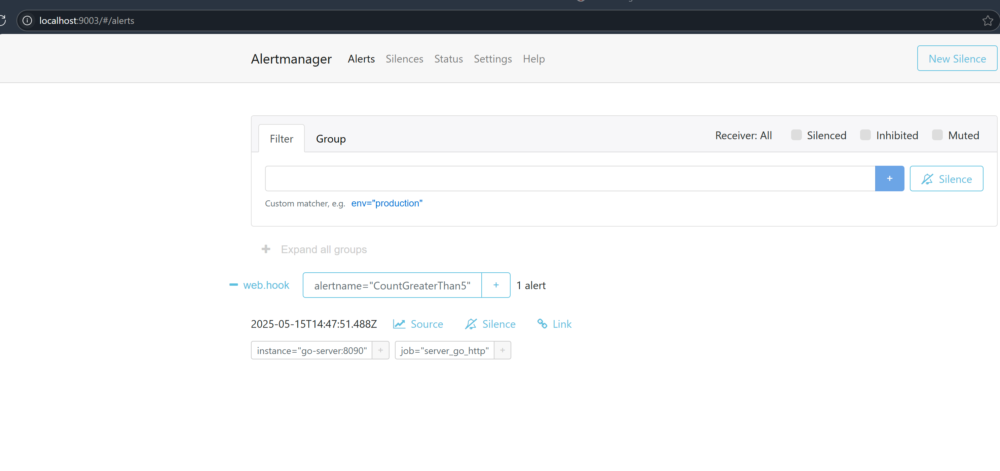
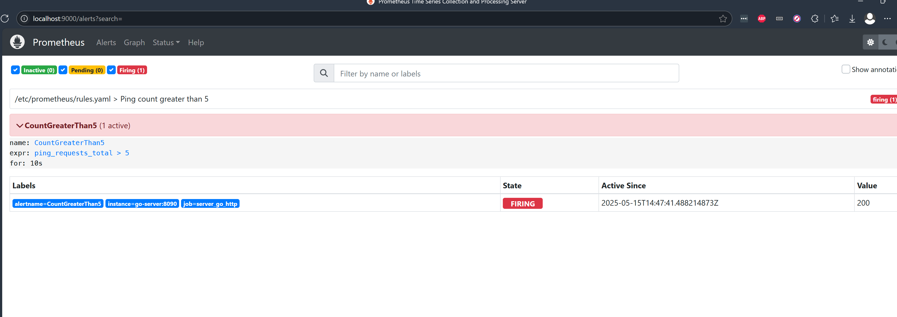

# Prometheus Http Request Counter

- [Instrumenting HTTP Server in Go](https://prometheus.io/docs/tutorials/instrumenting_http_server_in_go/)
- [Visualizing Metrics with Grafana](https://prometheus.io/docs/tutorials/visualizing_metrics_using_grafana/)
- [Alerting based on Metrics](https://prometheus.io/docs/tutorials/alerting_based_on_metrics/)

## Generate Traffic

```sh
sh ApacheBenchmark.sh -n 100 http://host.docker.internal:9001/ping
```

## Deployed URLs

- [Prometheus](http://localhost:9000)
- [Sample Server](http://localhost:9001)
- [Grafana](http://localhost:9002)
- [Alert Manager](http://localhost:9003)
- [Webhook](http://localhost:9004)
- [Logging Proxy](http://localhost:9005)

Endpoints
- [Ping Endpoint](http://localhost:9001/ping)
- [Metrics Endpoint](http://localhost:9002/metrics)
- [Rules](http://localhost:9000/rules)
- [Alerts](http://localhost:9000/alerts)


## Example Output

- Server Metrics

- [Prometheus Metrics](http://localhost:9000/graph?g0.expr=ping_requests_total&g0.tab=0&g0.display_mode=lines&g0.show_exemplars=0&g0.range_input=1h)



- Grafana



- Prometheus Rules


- Alert Manager Alerts



- Prometheus Alerts



